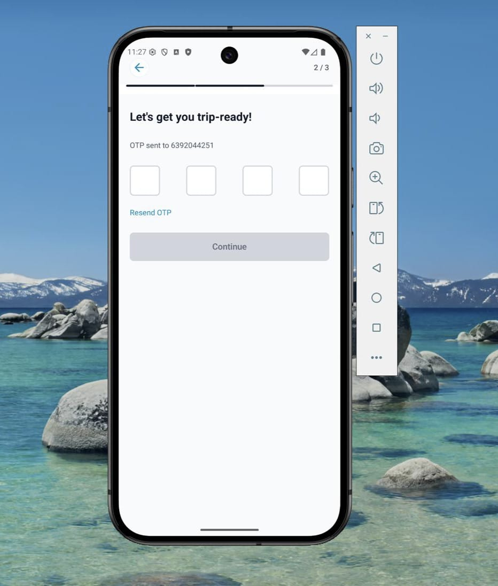
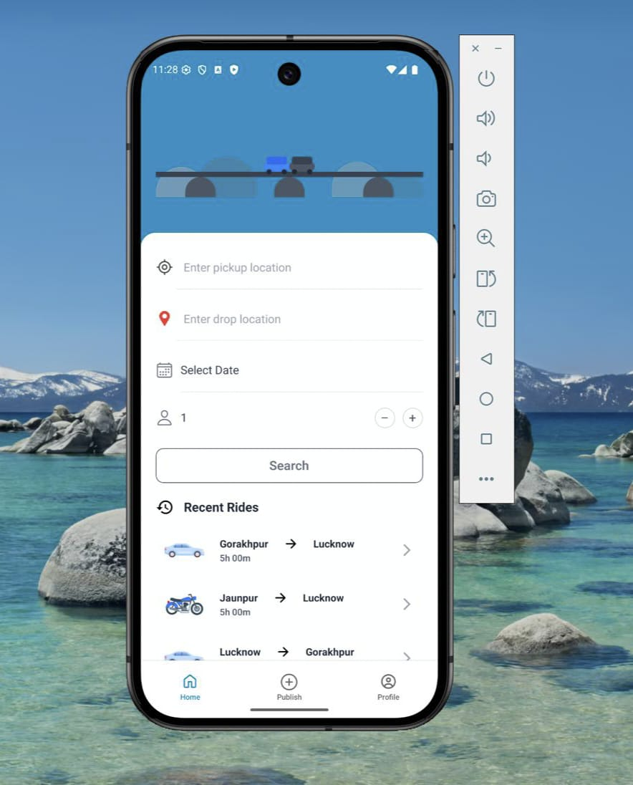
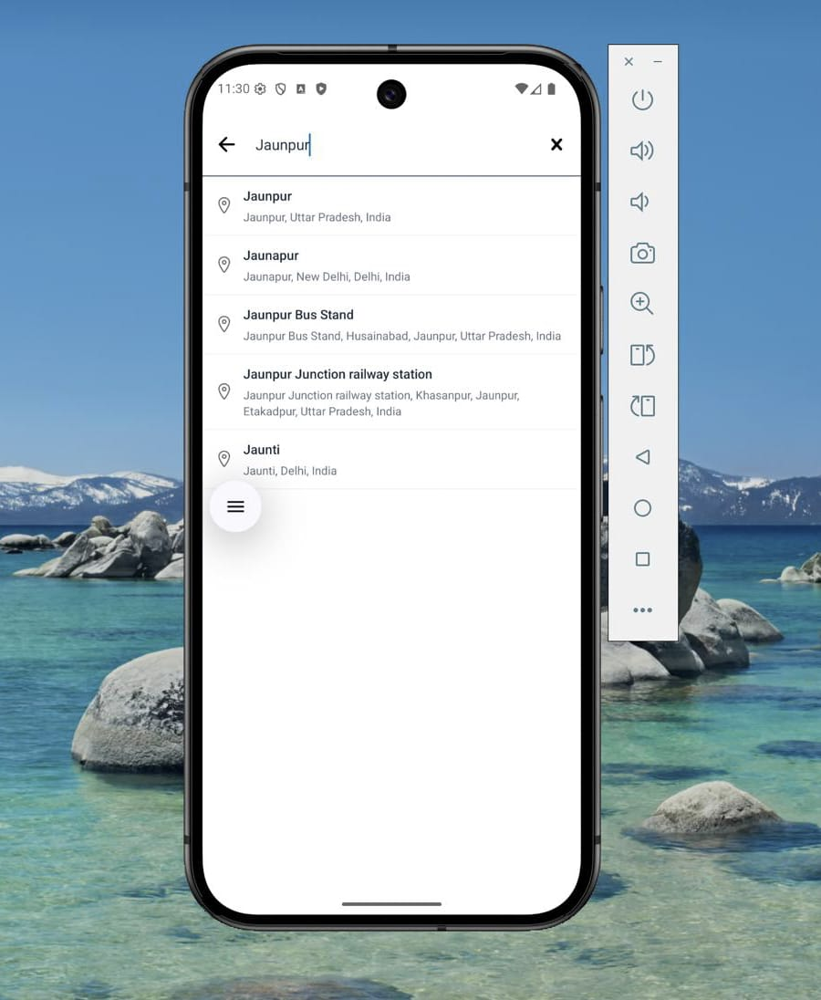
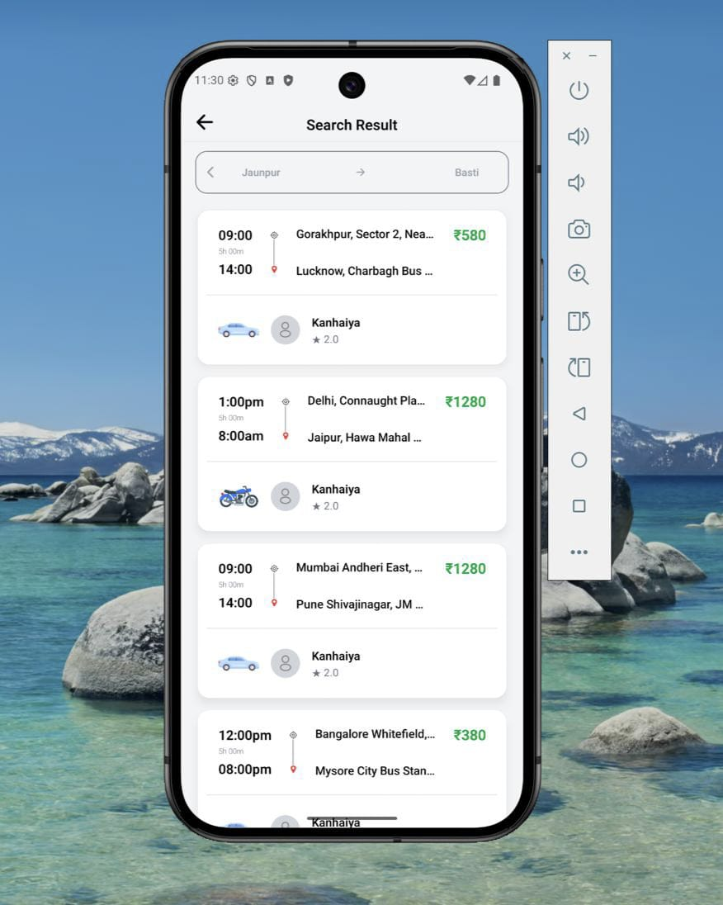
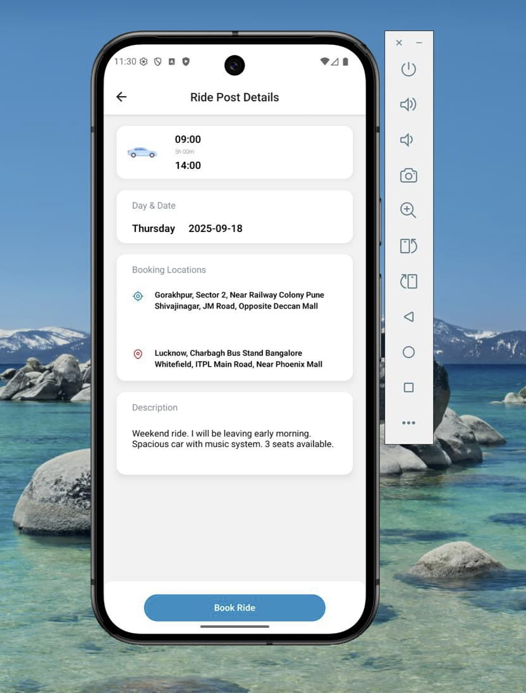
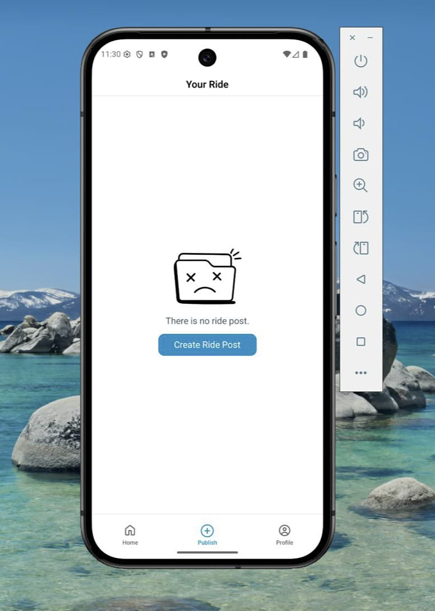
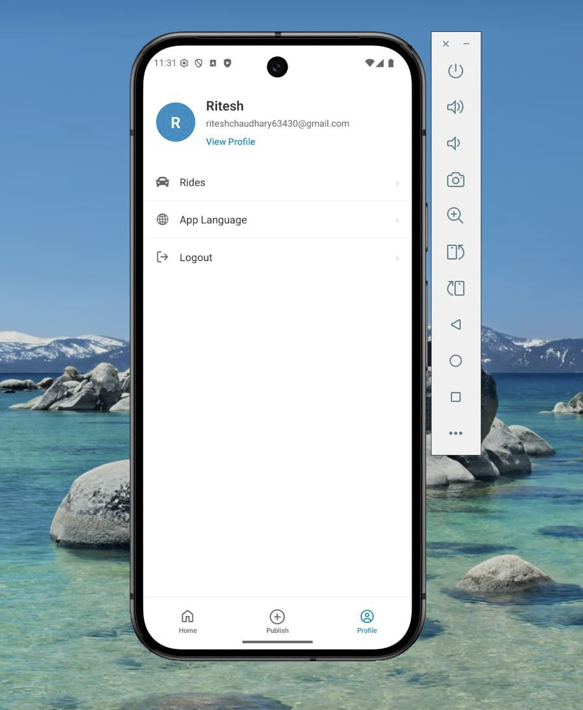
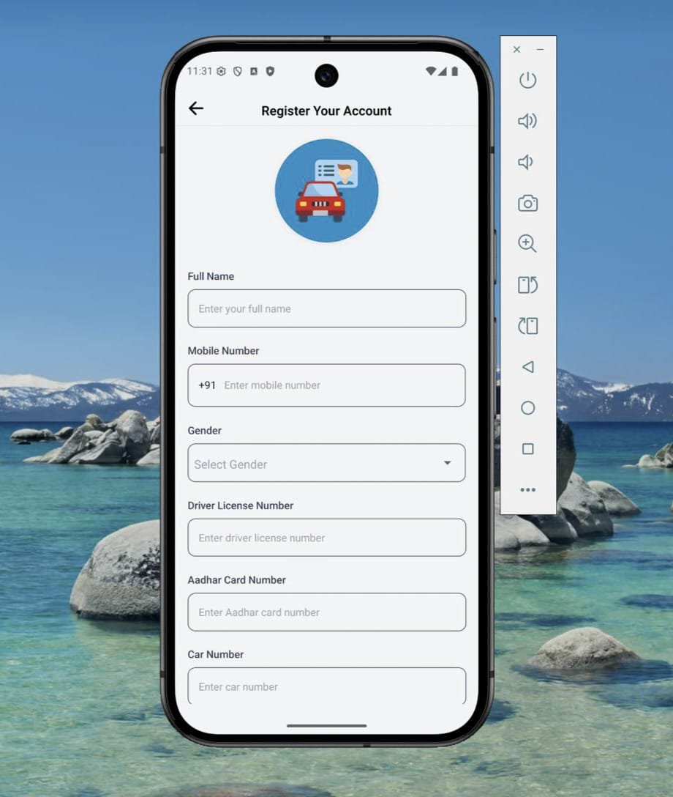

# ⚡ Saathi — Expo + Tailwind + Redux + Router Template

A clean, scalable starter for building React Native apps with Expo, styled using Tailwind (NativeWind), powered by Redux Toolkit, and navigated with Expo Router (Tabs & Drawer included).

This README is simplified to focus on quick setup and an inline horizontal screenshots gallery.

---

## Quick Links

- Project root: `app/`, `src/`, `assets/`
- Expo: https://docs.expo.dev/
- Router: https://expo.github.io/router/docs
- NativeWind: https://www.nativewind.dev/
- Redux Toolkit: https://redux-toolkit.js.org/

---

## Project Summary

Saathi is an Expo-based React Native template that combines modern libraries and conventions to help you ship mobile apps faster. It includes:

- File-based navigation via Expo Router with Drawer & Tabs
- Styling with Tailwind (NativeWind)
- State management using Redux Toolkit

---

## Installation

Prerequisites: Node.js, yarn or npm, and Expo CLI (optional but recommended).

```sh
# install dependencies
npm install
# or
# yarn install
```

---

## Development

Start the Expo development server with hot reload:

```sh
npx expo start
```

Open in Expo Go or run on a simulator:

```sh
npx expo run:android
npx expo run:ios
```

---

## Build

Build for production with EAS (recommended):

```sh
eas build
```

---

## Environment Variables

Add a `.env` in the project root for public environment variables used by Expo (example):

```env
EXPO_PUBLIC_API_URL=https://api.example.com
```

---

## App Screenshots
<div style="display:flex; gap:12px; align-items:flex-start; overflow-x:auto; padding:8px 0;">
  
  
  
  
  
  
  
  
  
  
</div>

